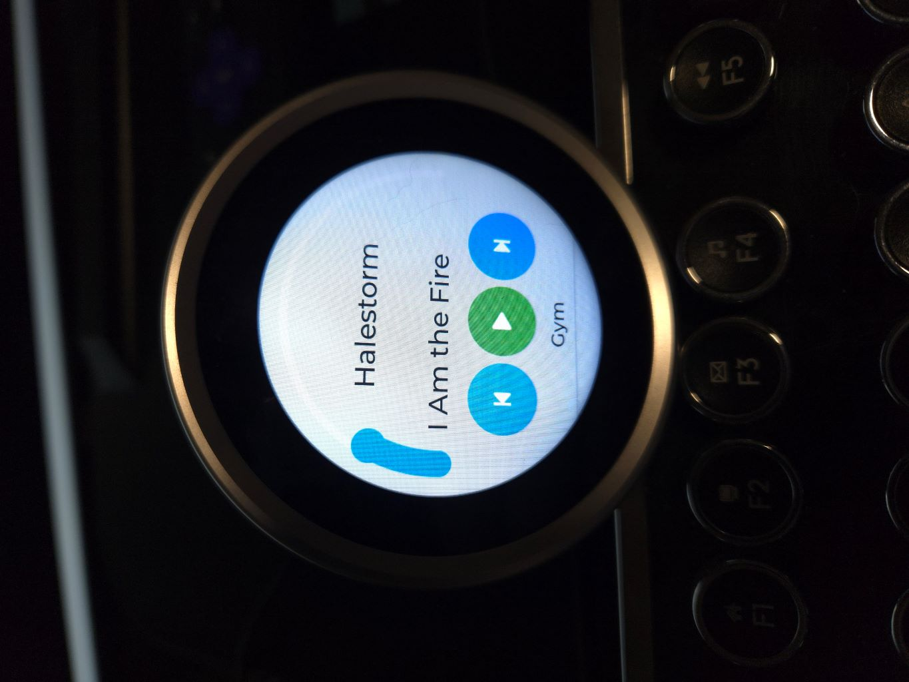

# Standalone Remote for Sonos with ESP32
A long time ago, Sonos made  stand alone remote to control their speakers. Since everyone has a smartphone, Sonos has long since discontinued the remote. This project uses ESP32 displays as a basic controller for Sonos players.  At this time, it only controls volume and mute, advances to prev/next song, and starts/stops playback. If there is nothing in the sonos queue, it will not add anything to the queue. I use Alexa for that.



## Requirements

The examples show code for the [Ma Touch 2.1 Rotary display](https://www.makerfabs.com/matouch-esp32-s3-rotary-ips-display-with-touch-2-1-st7701.html), an ESP32 with a a built-in 2.1" LCD display (480x480) touchscreen with a rotary bezel. The support page is [here](https://wiki.makerfabs.com/MaTouch_ESP32_S3_2.1_Rotary_TFT_with_Touch.html).
 There is also an example for the [Waveshare 4.3 inch display](https://www.waveshare.com/esp32-s3-touch-lcd-4.3.htm).

## Dependencies

This project uses the following libraries.  

**[Arduino GFX](https://github.com/moononournation/Arduino_GFX)**
The controller sfotware has been tested with version 1.5.x of this graphics driver library. This library requires version 3.1.x of esp32 by Espressif Systems. This is under Board Manager in the Arduino IDE. Platfomio doesn't support current versions of the esp32 library by default. 

**[LVGL](https://github.com/lvgl/lvgl)**
I use LVGL 9 for the display widgets. Using LVGL with Arduino requires some extra steps, be sure to read the docs [here](https://docs.lvgl.io/master/details/integration/framework/arduino.html). This project doesn't need any special configuration; just use a standard ESP32, Arduino file. **Note**:This project does not use the TFT_eSPI library mentiuoned in the LVGL documents. This ues Arduino GFX instead. 

## Incldued libraries
This library includes hardforks are other projects. These have been modified in ways that make them not compatible with any other version of these libraries. Links are provided for refernce and to credit other people's work.

**MicroXPath**
This is a hard fork of the XML procesor found [here](https://github.com/tmittet/microxpath). 

**SonosUPnP**
This is a hard fork of the Sonos processing library found [here](https://github.com/javos65/Sonos-ESP32). This is an amazing library. I've only scratched the surface of the functions, but at same time it is showing its age. For example, there is no support for streaming services like Spotify. 

## Instructions
Download all the source files and install them into your Arduino Libraries folder, under "esp32_sonos". You will need to configure two variables, "ssid" and "WiFipassword" for your Wifi setup.

```cpp
const char *ssid         = "My Home Wifi";               // Change this to your WiFi SSID
const char *WiFipassword = "MySuperSecretPassword";      // Change this to your WiFi password
```

## Usage

The controller scans the network on boot to find Sonos devices. If two devices are configured as a stereo pair, they will both show up, but only one will report playing music.

- For the rotary display, the bezel is the volume dial. Pressing the bezel toggles mute.
- Touch the zone name to change to the next zone in your list or open the list of players and select one. The zone list will wrap around to the first entry when it reaches the end.
- If the selected devices is not playing music, the backlight will turn off after 5 minutes

## ToDo
 Obvious improvements would include:

Resolve the issue with stereo pairs. This is the difference between devicews and zones.
Display and toggle modes like shuffle and repeat.  This would nbt be hard, but I don't use those features much.
The abiity to update/change the queue. This is clearly the missing function, but we use Alexa to start playback, so I'm not sure it is worth the time. Let me know.